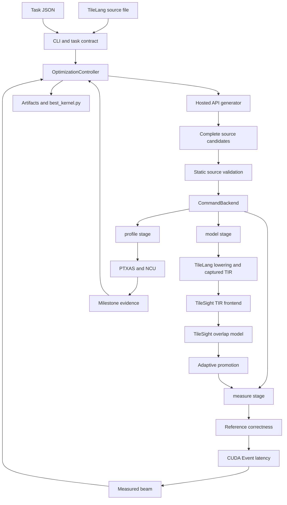

# 当前 Kernel Optimization 系统：执行流程、代码映射与改进路线

> Baseline note: this document records the architecture at commit `8c9f3f9`
> before the phased implementation began. The implementation status and current
> commands are maintained in `README.md`; the gap analysis below remains the
> design rationale for Phases 0-3.

> 文档范围：当前 `Compiler-Centric-Performance-Modeling-and-Optimization-for-AI-on-Modern-GPUs` 仓库，以及它调用的 sibling `TileSight` 仓库。
>
> 当前框架版本：`0.2.0`（见 `src/kernel_optimization/cli.py`）。
>
> 本文依据当前源代码静态分析整理；本次没有运行测试或 GPU 实验。

## 1. 一句话定位

当前系统是一个 **source-first、LLM-driven、adaptive-fidelity** 的单 kernel 优化框架：

1. 用户提交一份完整 TileLang kernel 源码和一份不可由模型修改的 task JSON；
2. Hosted LLM 根据源码、TileSight 预测、历史实测和可用 NCU evidence，生成若干份完整替代源码；
3. 所有静态合法候选都先经过 TileSight TIR frontend 和 analytical performance model；
4. 只有一小部分候选会被提升到真实 GPU correctness 和 CUDA Event latency measurement；
5. 每轮最多选择一个 milestone 候选运行 NCU；
6. 只有 correctness 通过且真实测过 latency 的候选能进入 measured beam 或成为最终输出。

系统的研究目标不是让 TileSight 完全替代实测，而是研究：

> TileSight 能否作为廉价、compiler-visible 的筛选层，在相同 wall-clock、GPU、NCU 和 LLM 预算下，用更少的昂贵硬件评估找到同样好或更好的 kernel？

## 2. 当前系统边界



### 2.1 Controller 与 compiler runtime 的隔离

Controller 本身不 import TileLang、TVM、CUDA、TileSight 或 NCU。它只依赖 Python standard library，并通过 JSON + subprocess contract 调 evaluator。

这层边界由以下代码构成：

- `src/kernel_optimization/protocols.py`
  - `CandidateGenerator`：候选生成接口；
  - `PerformanceBackend`：`model / measure / profile` 三阶段接口。
- `src/kernel_optimization/backends/command.py`
  - `CommandBackend`：将候选源码写入临时目录，生成 `request.json`，运行外部 evaluator，并读取 `response.json`。
- `examples/tilesight_matmul_adapter.py`
  - 当前 Matmul 任务的具体 evaluator；
  - 只有这个进程真正 import TileLang 和 TileSight，并执行 GPU/NCU 工作。

## 3. 输入是什么

用户必须提供两个输入。

### 3.1 可优化的完整源码

当前例子是：

```text
examples/tilelang_matmul_kernel.py
```

入口函数为：

```python
make_matmul_program(
    m=2048,
    n=2048,
    k=2048,
    block_m=128,
    block_n=128,
    block_k=32,
    num_stages=3,
    threads=128,
)
```

源码构造一个 TileLang `PrimFunc`，包含：

- `128 x 128 x 32` CTA/GEMM tile；
- 128 threads；
- 3-stage `T.Pipelined` K loop；
- global-to-shared copies；
- `T.gemm`；
- fragment-to-shared-to-global epilogue。

LLM 不是只修改预先列出的参数。它返回整份源码，因此理论上可以修改 tiling、threads、pipeline、memory layout、TileLang primitive、fusion structure 和算法结构。

原始源码不会被原地修改。每份候选都有独立 source SHA-256 和 `candidate_id`。

### 3.2 不可由模型修改的 task contract

当前例子是：

```text
examples/tilelang_matmul_task.json
```

关键字段如下。

| 字段 | 当前值 | 实际作用 |
|---|---:|---|
| `task_id` | `tilelang_matmul_2048_rtx3090` | 候选 identity、artifact ownership |
| `reference` | Matmul 语义文字 | 进入 LLM prompt；不是实际 correctness 函数 |
| `entrypoint` | `make_matmul_program` | 静态检查和 adapter import |
| `target.architecture` | `rtx3090` | 主要进入 prompt；adapter 并不直接用它创建 arch |
| `target.tilelang_target` | `cuda -arch=sm_86` | TileLang lowering/compilation target |
| `target.write_policy` | `write-through` | TileSight global-write traffic 解释 |
| `workload.factory_arguments` | `m=n=k=2048` | 调用 kernel factory 的实际参数 |
| `output_indices` | `[2]` | 指定输出 tensor |
| `atol / rtol` | `0.01 / 0.01` | correctness tolerance |
| `warmup_ms / rep_ms` | `25 / 100` | CUDA benchmark 配置 |
| `constraints` | entrypoint、size、required/forbidden strings | 静态源码 gate |
| `budget` | 4 rounds、6 proposals、beam 3、promotion 2-4 | 搜索和硬件评估预算 |
| `evaluator.command` | Matmul adapter | 外部 evaluator 命令 |
| `evaluator.timeout_seconds` | `1800` | 每个外部 stage 的总 timeout |
| `metadata.ncu_set` | `full` | NCU metric set |

### 3.3 一个重要的语义边界

`task.reference` 只是给 LLM 阅读的自然语言说明。真正的 correctness reference 位于：

```text
examples/tilesight_matmul_adapter.py::matmul_reference
```

其实际实现是：

```python
return a @ b.T
```

因此，当前系统的可信语义来自 adapter 中的 executable reference，而不是 task JSON 的文字本身。

## 4. 主要代码模块

### 4.1 Kernel optimization 仓库

| 文件 | 主要职责 |
|---|---|
| `src/kernel_optimization/cli.py` | CLI 参数、API 配置、task/source 加载、controller 创建 |
| `src/kernel_optimization/schema.py` | Task、candidate、model、measurement、profile、summary 数据结构 |
| `src/kernel_optimization/prompts.py` | English system prompt 和每次优化 request |
| `src/kernel_optimization/generators/api.py` | OpenAI-compatible Chat Completions 调用和 JSON candidate 解析 |
| `src/kernel_optimization/source_validation.py` | Python AST、entrypoint、source size、字符串约束检查 |
| `src/kernel_optimization/controller.py` | 整个 seed + round search 状态机 |
| `src/kernel_optimization/selection.py` | TileSight 后的 adaptive promotion |
| `src/kernel_optimization/trust.py` | TileSight prediction 与真实 measurement 的在线信任度 |
| `src/kernel_optimization/milestones.py` | 何时、对哪个候选运行 NCU |
| `src/kernel_optimization/archive.py` | candidate、event、state、summary、best source 归档 |
| `src/kernel_optimization/factory.py` | 根据 task JSON 创建 evaluator backend |
| `src/kernel_optimization/backends/command.py` | evaluator subprocess JSON contract |
| `examples/tilesight_matmul_adapter.py` | Matmul 的 TileSight、correctness、CUDA Event、NCU 实现 |

### 4.2 TileSight 仓库

| 文件 | 主要职责 |
|---|---|
| `tilesight/tir_interface/tilelang_integration.py` | `model_tilelang_program`，TileLang lowering 到 TileSight 的总入口 |
| `tilesight/tir_interface/capture.py` | TVM `PassInstrument`，捕获 semantic/physical TIR snapshots |
| `tilesight/tir_interface/collector.py` | `TIRFrontend`，从 TIR 提取 loop、operation、access、resource、dependency |
| `tilesight/tir_interface/official_visitor.py` | 基于 TileLang bundled TVM TIRx visitor 的 stmt/expr 遍历适配 |
| `tilesight/tir_interface/model_enrichment.py` | cache plan、L1.5/L2/DRAM hit/miss 估计 |
| `tilesight/tir_interface/lower_to_overlap.py` | frontend schema 转换成原 TileSight overlap model 输入 |
| `tilesight/tir_interface/api.py` | `model_tir`，调用 `overlap_analysis_full` 并返回统一 metrics |
| `tilesight/tir_interface/compiler_resources.py` | 从 compiled module 提取 launch/shared-memory 信息 |
| `tilesight/tir_interface/registers.py` | PTXAS register、shared memory、spill 解析 |
| `tilesight/tir_interface/validation.py` | correctness、CUDA benchmark、NCU CSV 解析 |

## 5. 从命令行开始的实际调用链

运行命令：

```bash
PYTHONPATH=src python3 -m kernel_optimization.cli \
  --source examples/tilelang_matmul_kernel.py \
  --task examples/tilelang_matmul_task.json \
  --output results/matmul_api_full_01
```

### 5.1 CLI 初始化

入口：

```text
src/kernel_optimization/cli.py::main
```

执行顺序：

1. 解析 `--source / --task / --output` 和 API flags；
2. 读取 source text；
3. `TaskSpec.from_json_file()` 解析 task；
4. 从 flag 或环境变量读取：
   - `KERNEL_OPT_API_URL`
   - `KERNEL_OPT_API_MODEL`
   - `KERNEL_OPT_API_KEY`
5. 创建 `OpenAICompatibleGenerator`；
6. `create_backend()` 根据 task 创建 `CommandBackend`；
7. 检查 output 必须为空或不存在；
8. 创建 `OptimizationController`；
9. 调用 `controller.run()`；
10. 只有全部完成后才打印 summary 和 best source path。

当前没有 API connectivity/quota preflight。也就是说，程序会先完成 seed 的 TileSight、correctness、benchmark 和 NCU，之后第一次真正调用 API 才发现 key、quota 或 endpoint 问题。这正是本次 `credit_balance_exhausted` 之前等待很久的原因。

## 6. Seed kernel 初始化

入口：

```text
src/kernel_optimization/controller.py::run
src/kernel_optimization/controller.py::_initialize_seed
```

seed 是用户提供的原始 kernel，generation 为 0，parent 为 `None`。

严格执行以下步骤：

1. `SourceValidator.validate()` 检查原始源码；
2. `ArtifactStore.initialize()` 写 `task.json`；
3. 立即保存 seed source 和初始 `record.json`；
4. `backend.model()`：运行 TileSight；
5. model invalid 则整次 run 终止；
6. `backend.measure()`：correctness + CUDA Event；
7. correctness failed 则整次 run 终止；
8. `backend.profile()`：seed 无条件运行一次 NCU；
9. seed 标为 `measured-beam`；
10. measured beam 初始只有 seed。

因此，当前系统要求输入 kernel 本身必须：

- 能通过静态检查；
- 能被 TileLang/TileSight 处理；
- 数值正确；
- 能成功获得真实 latency。

Seed NCU 失败不会阻止搜索继续，但 profile 会被标记为 invalid。

## 7. 一轮搜索具体做什么

每轮由 `OptimizationController.run()` 依次调用：

```text
_generate_round
    -> _model_candidates
    -> AdaptiveSelectionPolicy.select
    -> _measure_candidates
    -> _update_beam
    -> _maybe_profile_round
    -> _save_round_state
```

### 7.1 给每个 beam parent 分配 proposal budget

代码：

```text
src/kernel_optimization/controller.py::_generate_round
```

每轮总 proposal budget 是 `proposals_per_round`。Controller 对当前 measured beam 中的 parent 逐个调用 generator，并尽量平均分配剩余 proposal 数。

例如 beam 有 3 个 parent、每轮 proposal budget 为 6，通常每个 parent 请求 2 个候选，因此这一轮可能有 3 次 API call，而不是 1 次。

### 7.2 构造 LLM prompt

代码：

```text
src/kernel_optimization/prompts.py::build_optimization_prompt
```

每次 prompt 包含：

- task description 和 reference semantics；
- target、workload、constraints；
- 当前 parent 的完整源码；
- parent 的 TileSight prediction；
- parent 的真实 measurement；
- parent 自己已有的 NCU profile；
- 当前 model trust；
- 最近最多 12 条 candidate history；
- 完整 JSON response schema。

Prompt 明确区分：

- `observed_evidence`：真实 GPU/NCU 证据；
- `predicted_evidence`：TileSight analytical prediction。

它要求 LLM 返回若干份完整替代源码，而不是 diff/patch。

### 7.3 调用 Hosted API

代码：

```text
src/kernel_optimization/generators/api.py::OpenAICompatibleGenerator.generate
src/kernel_optimization/generators/api.py::_post_json
```

当前请求是：

```json
{
  "model": "configured-model",
  "messages": [
    {"role": "system", "content": "..."},
    {"role": "user", "content": "..."}
  ],
  "temperature": 0.4
}
```

当前只支持 OpenAI-compatible Chat Completions response：

```text
choices[0].message.content
```

content 必须能解析为：

```json
{
  "candidates": [
    {
      "hypothesis": "...",
      "source_code": "complete source",
      "expected_effect": {},
      "metadata": {}
    }
  ]
}
```

成功调用后记录 response ID、requested/response model、finish reason 和 provider usage。API key 本身不会被写入 artifact。

当前没有：

- retry/backoff；
- preflight；
- `Retry-After` 处理；
- `max_completion_tokens`；
- provider-native structured output；
- Responses API adapter；
- API failure event 持久化。

如果 HTTP/JSON 解析失败，异常会直接终止整个 run。

### 7.4 Candidate identity 与去重

代码：

```text
src/kernel_optimization/schema.py::Candidate._create
```

候选 identity 是：

```text
SHA256(task_id + NUL + complete_source_sha256)[:16]
```

因此：

- 同一 task 下完全相同的 source，即使来自不同 parent，也具有相同 `candidate_id`；
- source-level duplicate 会被去重；
- 只要空格、注释或格式不同，就会被视为不同候选；
- 当前没有 AST、TIR、PTX 或 binary-level deduplication。

### 7.5 静态源码检查

代码：

```text
src/kernel_optimization/source_validation.py::SourceValidator.validate
```

检查内容：

1. 文件扩展名必须为 `.py`；
2. 不能包含 null byte；
3. source bytes 不能超限；
4. `ast.parse()` 必须成功；
5. top-level entrypoint 必须存在；
6. 必须包含 required string fragments；
7. 不能包含 forbidden string fragments。

静态失败会产生 `proposal_rejected` event，但当前不会保存被拒绝的完整源码。

### 7.6 TileSight model stage

所有通过静态检查的新候选都会执行：

```text
OptimizationController._model_candidates
    -> CommandBackend.model
    -> tilesight_matmul_adapter.py::model_response
    -> model_candidate
    -> TileSight model_tilelang_program
```

#### 7.6.1 CommandBackend 做什么

`CommandBackend._run("model", ...)`：

1. 创建 `kernel-opt-command-*` 临时目录；
2. 写入完整 candidate source；
3. 写入 request JSON；
4. 执行：

```text
python3 examples/tilesight_matmul_adapter.py \
  --stage model \
  --request <temporary/request.json> \
  --response <temporary/response.json>
```

5. 捕获全部 stdout/stderr；
6. process return code 非零时抛出 infrastructure error；
7. 正常时读取 response JSON 并转换为 `ModelEvaluation`。

预期的 candidate compile/model failure 由 adapter 捕获并返回 `valid=false`，不应使用非零进程退出码。

#### 7.6.2 Adapter 如何构造程序

代码：

```text
examples/tilesight_matmul_adapter.py::load_program
```

执行顺序：

1. 使用 `importlib` 加载临时 candidate Python 文件；
2. 找到 task 指定的 `make_matmul_program`；
3. 使用 `factory_arguments={m:2048,n:2048,k:2048}` 调用 factory；
4. 获得 TileLang `PrimFunc`。

注意：加载模块本身会执行 candidate 的 top-level Python 代码。

#### 7.6.3 实际 GPU arch 与 TileLang target

代码：

```text
examples/tilesight_matmul_adapter.py::resolve_environment
```

- `get_device_name()` 检测当前物理 GPU；
- `create_device_arch(device_name).set_to_ncu()` 创建 TileSight arch；
- `target.tilelang_target` 决定 TileLang 编译 target。

这意味着 `target.architecture="rtx3090"` 当前没有用于校验物理 GPU。若 task 写 RTX 3090、实际机器不是 3090，TileSight arch 会按实际 GPU 创建，但 TileLang 仍可能按 `sm_86` 编译，系统不会主动报 target mismatch。

#### 7.6.4 TileLang lowering 与三层 TIR 信息

代码：

```text
TileSight/tilesight/tir_interface/tilelang_integration.py::model_tilelang_program
```

流程：

1. 创建 TVM `PassInstrument`；
2. 在 target context 和 `PassContext(opt_level=3)` 中调用 `tilelang.lower()`；
3. 捕获 semantic TIR；
4. 捕获 physical TIR；
5. 从 lowered module 提取 compiled launch resources；
6. 可选调用 PTXAS；
7. 调 `model_tir()`。

Normal `model` stage 使用 `collect_ptxas=False`，因此不会主动运行 PTXAS。`profile` stage 才使用 `collect_ptxas=True`。

捕获逻辑位于：

```text
TileSight/tilesight/tir_interface/capture.py
```

Semantic TIR 优先选择：

```text
before InjectSoftwarePipeline
或 after PipelinePlanning
```

Physical TIR 优先选择：

```text
after StorageRewrite
after VectorizeLoop
after FlattenBuffer
after LowerTileOp
```

Semantic snapshot 用于保留 tile operation、pipeline 和程序结构；physical snapshot 用于校正 allocation、threads/grid 和 lowered copy/async 信息。

#### 7.6.5 TIR frontend 读取什么

代码：

```text
TileSight/tilesight/tir_interface/collector.py::TIRFrontend.extract
TileSight/tilesight/tir_interface/official_visitor.py
```

Collector 使用 TileLang bundled TVM TIRx visitor 遍历 stmt/expr，并提取：

- grid dimensions；
- thread dimensions 和 threads per block；
- loop extent、嵌套和 pipeline depth/order；
- global/shared/local/fragment buffer；
- buffer read/write access、byte volume 和 index variables；
- TileLang copy/gemm/fill 等 tile operations；
- tensor FLOPs、CUDA-core scalar ops、SFU ops；
- shared-memory footprint；
- register footprint estimate；
- operation dependencies 和 loop-carried dependencies；
- async copy evidence；
- 无法可靠解析的信息及 diagnostics。

#### 7.6.6 非 TIR 信息如何补齐

代码：

```text
TileSight/tilesight/tir_interface/model_enrichment.py
TileSight/tilesight/tir_interface/lower_to_overlap.py
```

TIR 本身不能直接给出全部性能参数，因此还要补：

- cache reuse plan；
- per-tensor L1.5/L2/DRAM hit/miss；
- architecture bandwidth、SM count、frequency 和 capacities；
- occupancy / tiles per SM；
- write policy；
- PTXAS registers/spills（只在收集 PTXAS 时可用）；
- resource utilization limits。

`lower_program()` 把 frontend `KernelProgram` 转成原 TileSight overlap tree，并调用现有 occupancy/cache models。

最终 `model_tir()` 调用：

```text
tilesight.fused_op_pipeline_wave.overlap_analysis.overlap_analysis_full
```

得到 latency、memory hierarchy utilization、compute utilization 和 resource footprints。

#### 7.6.7 Adapter 返回给 search controller 的字段

`model_response()` 返回：

| 字段 | 来源 |
|---|---|
| `predicted_latency_ms` | `TileSight metrics.latency * 1000` |
| `ddr_util` | TileSight overlap model |
| `l2_hit_rate` | TileSight cache model |
| `l2_util` | TileSight overlap model |
| `smem_util` | TileSight overlap model |
| `tensor_util` | TileSight overlap model |
| `cuda_util` | TileSight overlap model |
| `sfu_util` | TileSight overlap model |
| `shared_memory_per_block` | TIR/compiled resource enrichment |
| `registers_per_thread` | TIR estimate，normal model stage 通常无 PTXAS override |
| `bottleneck` | 上述六类 utilization 的最大值对应名称 |
| `confidence` | 无 frontend diagnostics 为 `high`，否则为 `medium` |

这里的 bottleneck 是一个很粗的 `argmax(utilization)` heuristic，不是完整的 roofline/SOL diagnosis。

### 7.7 Adaptive promotion：谁值得真实测量

代码：

```text
src/kernel_optimization/selection.py::AdaptiveSelectionPolicy
```

只有 `model.valid=true` 且有 predicted latency 的候选可进入 promotion pool。

每轮真实测量数为：

```text
round(max_promotions - trust_score * (max_promotions - min_promotions))
```

并限制在 `[min_promotions, max_promotions]` 和可用候选数内。

当前 task：

```text
min_promotions = 2
max_promotions = 4
```

因此：

- 初始 trust 为 0，趋向真实测 4 个；
- TileSight 越可信，趋向只测 2 个；
- 这是系统对 model error 的安全阀。

Promotion batch 按顺序混合：

1. `model-top`：predicted latency 最小的前半部分；
2. `low-confidence-audit`：TileSight confidence 最低者；
3. `source-diversity`：与 beam/已选源码 line sequence 差异最大者；
4. `random-audit`：用固定 random seed 补满。

未提升候选保留为 `modeled-not-promoted`，永远不能直接成为最终 best。

### 7.8 Measure stage：correctness 和真实 latency

代码：

```text
OptimizationController._measure_candidates
CommandBackend.measure
tilesight_matmul_adapter.py::measure_response
TileSight validation.run_tilelang_validation
```

流程：

1. 再次加载并构造 candidate program；
2. 编译/运行 candidate；
3. 与 adapter 中不可修改的 `matmul_reference` 比较；
4. 使用 task 的 atol、rtol 和 mismatch ratio；
5. correctness 通过后，用 CUDA Event benchmark；
6. 返回 median latency；
7. correctness 失败的候选标为 `correctness-failed`。

当前 `samples_ms` 只保存一个 `benchmark_latency_ms`，并没有保存 validation helper 内部的全部 raw timing samples。

真实 CUDA Event latency 是 beam 和最终 best 的官方排序依据。TileSight predicted latency 只负责 promotion，不直接决定最终答案。

### 7.9 Online model trust

代码：

```text
src/kernel_optimization/trust.py::TrustTracker
```

每个 correctness 通过且被实测的 candidate 用于更新：

1. Prediction 的 absolute relative error：

```text
abs(predicted - measured) / measured
```

2. 相对 parent 的优化方向是否一致：

```text
sign(predicted_candidate - predicted_parent)
vs.
sign(measured_candidate - measured_parent)
```

Trust score：

- 没有 measurement 时为 0；
- 只有 absolute error 时，使用 `0.4 * absolute_score`；
- 有 direction data 时，使用 `0.7 * direction_accuracy + 0.3 * absolute_score`。

这个 trust 只控制下一轮真实测量预算，没有校准 TileSight 的具体参数或预测值。

### 7.10 Measured beam 更新

代码：

```text
src/kernel_optimization/controller.py::_update_beam
```

候选进入 beam 必须同时满足：

- 已真实测量；
- correctness 通过；
- latency 非空。

Controller 将旧 beam 和本轮正确候选合并，严格按 measured latency 升序排序，保留 `beam_width` 个。

当前没有：

- measurement uncertainty；
- confidence interval；
- statistical tie handling；
- code size/resource 多目标；
- regression tolerance。

### 7.11 NCU milestone

代码：

```text
src/kernel_optimization/milestones.py::NcuMilestonePolicy
src/kernel_optimization/controller.py::_maybe_profile_round
examples/tilesight_matmul_adapter.py::profile_response
```

Seed 一定 profile。之后每轮最多 profile 一个尚未成功 profile 的候选。

Trigger 优先级：

1. best measured latency 提升超过 `ncu_improvement_threshold`；
2. TileSight 与 measured 的优化方向不一致；
3. 被测候选 model confidence 低；
4. 距离上次 NCU 太久；
5. 搜索 plateau。

Profile stage：

1. 再次调用 `model_candidate(..., collect_ptxas=True)`；
2. 从 PTXAS 获取 registers、static shared memory 和 spills；
3. 运行 `ncu --set full --cache-control all`；
4. NCU 子进程运行 adapter 的 `--run-once`；
5. 导出 raw CSV；
6. `load_ncu_metrics()` 选择 kernel launch 并解析指标；
7. 用实际 NCU utilization 最大项给出粗 bottleneck label；
8. 保存 `.ncu-rep` 和 CSV。

#### 当前 NCU 的真实作用

NCU **不会直接修改 TileSight model 参数，也不会重新拟合 cache/utilization/latency 公式**。

它目前只作为 candidate profile evidence：

- 如果该 candidate 是下一轮被扩展的 parent，profile 会进入该 parent 的 prompt；
- profile 信息不会自动形成全局 diagnosis；
- 非 beam 或不再被选作 parent 的 milestone candidate，其 NCU evidence 可能不会影响后续 generation；
- trust tracker 只比较 TileSight latency 和 CUDA Event latency，不使用 NCU metrics。

所以当前说“NCU calibration”并不准确。更准确的表述是：

> NCU provides occasional observed evidence to the LLM, but does not yet calibrate the analytical model.

## 8. 每轮结束和最终输出

### 8.1 每轮 state

代码：

```text
src/kernel_optimization/controller.py::_save_round_state
```

写入 `state.json`：

- 当前 round；
- beam candidate IDs；
- best candidate 和 source hash；
- best measured latency；
- trust；
- NCU/API call counters；
- provider token usage。

`state.json` 每轮覆盖，只保留最新 snapshot。当前 controller 不支持从它 resume。

### 8.2 Run 完成

最终：

1. beam 第一名写为 `best_kernel.py`；
2. 保存 `best_candidate.json`；
3. 保存 `summary.json`；
4. 在 `events.jsonl` 追加 `run_completed`。

### 8.3 Artifact 目录

```text
<output>/
├── task.json
├── events.jsonl
├── state.json
├── summary.json
├── best_candidate.json
├── best_kernel.py
└── candidates/
    └── <candidate-id>/
        ├── record.json
        └── tilelang_matmul_kernel.py
```

每个 `record.json` 最终包含：

- candidate ID、parent、generation、source SHA；
- hypothesis、expected effect、proposal metadata；
- 最终 state；
- TileSight model result；
- correctness 和 measured latency；
- optional NCU profile；
- selection reasons 和 decision reason。

`events.jsonl` 当前记录：

- successful generator calls；
- proposal rejection；
- source deduplication；
- 每轮生成数量；
- NCU success/failure；
- run completion。

但它没有 timestamp，也没有记录所有 stage transition。

## 9. 当前完整任务的最大工作量

当前配置：

```text
rounds = 4
proposals_per_round = 6
beam_width = 3
max_promotions_per_round = 4
```

理论上最多：

| 操作 | 最大数量 |
|---|---:|
| 新 LLM candidates | 24 |
| 总 candidates（含 seed） | 25 |
| API calls | 约 10（round 1 为 1，之后每轮最多 3） |
| TileSight model stages | 25 |
| 真实 measurements | 17（seed + 每轮最多 4） |
| NCU profiles | 5（seed + 每轮最多 1） |

所有工作当前基本串行执行。

### 9.1 为什么运行时像“卡住”

当前 CLI 在 run 完成前不打印阶段进度；`CommandBackend` 又使用：

```python
stdout=subprocess.PIPE
stderr=subprocess.STDOUT
```

成功时 captured output 不会打印。因此编译、TileSight、CUDA benchmark 和 NCU 都可能长时间静默。只有 evaluator 非零退出时，最后 4000 个字符才进入异常。

## 10. 当前版本已经实现了什么

### 10.1 已成立的核心设计

- 输入是完整 kernel source，不是人工枚举的有限参数表；
- LLM 可以提出开放式源码变换；
- 原始 source 和 evaluator/reference 分离；
- 所有候选先走统一 static gate；
- TileSight 覆盖所有 model-valid candidates；
- 真实 correctness 是硬门禁；
- 最终 best 必须真实测过；
- adaptive promotion 会在 TileSight 不可信时增加 audit；
- source diversity 和 random audit 防止完全依赖错误 ranking；
- NCU 被限制在 milestone，而不是每个候选；
- source、lineage、evidence 和 best artifact 会归档。

### 10.2 当前系统没有做的事

- 没有从自然语言需求自动构造可信 reference；
- 没有从任意 TileLang example 自动推导 evaluator contract；
- 没有自动 repair compile/correctness failures；
- 没有 rule-based 或 LLM-based structured hardware diagnosis；
- 没有用 NCU 校准 TileSight；
- 没有跨 run persistent search；
- 没有 resume；
- 没有并行 generation/compilation/evaluation；
- 没有 PTX/binary dedup；
- 没有 hidden/multi-shape final evaluation；
- 没有 kernel portfolio、dispatcher 或 full-model runtime integration。

## 11. 当前最需要改进的问题

下面按优先级排序。

## P0：先保证一次昂贵实验可靠、可观察、可恢复

### P0.1 API preflight 必须发生在 seed NCU 之前

现状：

- `controller.run()` 先完整评估并 profile seed；
- 第一轮才调用 API；
- key/quota/model/endpoint 错误会浪费一次 seed compile、measurement 和 NCU。

修改位置：

- `generators/api.py`：新增 `preflight()`；
- `cli.py`：创建 controller 前验证 auth、model access 和 response schema；
- 或增加 `--skip-api-preflight`，默认不跳过。

### P0.2 增加实时进度和阶段计时

现状：运行过程几乎完全静默。

需要显示：

```text
[seed/model]
[seed/measure]
[seed/profile]
[round 1/generate parent 1/1]
[round 1/model candidate 2/6]
[round 1/measure candidate 1/4]
[round 1/profile]
```

修改位置：

- `controller.py`：stage start/end events；
- `command.py`：可选 stream evaluator output；
- `cli.py`：console progress reporter；
- `schema.py`：stage duration/cost records。

### P0.3 API robustness

需要增加：

- retry with exponential backoff；
- `Retry-After`；
- 区分 retryable 429 和 non-retryable `insufficient_quota`；
- configurable output-token limit；
- malformed/truncated JSON repair；
- structured-output response schema；
- failed API attempt event；
- request ID 和 duration。

修改位置：`generators/api.py`、`schema.py`、`archive.py`。

### P0.4 清理 evaluator 环境中的 secrets

这是当前最严重的安全问题。

`CommandBackend._run()` 使用：

```python
environment = os.environ.copy()
```

因此 candidate Python 被 import/执行时，会继承：

- `KERNEL_OPT_API_KEY`；
- API URL/model；
- 其他用户环境变量和可能的 credentials。

Prompt 虽然禁止读取环境，但 prompt 不是安全边界。当前 static validator 也不能阻止任意 Python 方式读取文件、网络和环境。

必须修改：

- `CommandBackend` 改成 environment allowlist；
- 显式删除 API key 和 provider credentials；
- candidate evaluator 禁网；
- 限制 filesystem 写范围；
- 使用 container/process sandbox；
- 将 immutable evaluator/reference 设为 candidate 无写权限；
- 设置 CPU、RAM、process、GPU 和 wall-time limits。

### P0.5 可恢复运行

现状：

- output 非空就拒绝启动；
- `state.json` 不能恢复；
- API/基础设施异常会留下 partial artifacts，但没有 `summary.json`；
- 已完成的 seed/TileSight/measurement/NCU 会在新目录重跑。

需要：

- `--resume <run-dir>`；
- immutable per-round snapshots；
- stage-level cache key；
- attempt 状态 `pending/running/succeeded/failed`；
- restart 时只重跑未完成 stage；
- exception 时写 `run_failed` event 和 failure summary。

### P0.6 完整、不可变、带时间戳的 trace

需要保存：

- `rounds/round_001.json`；
- 每次 API sanitized request/response；
- 每个 stage start/end/time；
- compiler stdout/stderr；
- rejected candidate source；
- exact command 和 exit status；
- git commit；
- Python、CUDA、driver、TileLang、TVM、TileSight、NCU 版本；
- GPU UUID/name/clock/power state；
- API model response ID 和 usage；
- 不保存 API key/header。

## P1：让硬件反馈真正驱动下一轮

### P1.1 Compile/correctness repair loop

现状：失败候选被归档后结束，LLM 只看到简化 history；history 没有 compiler diagnostics 或 correctness error。

需要：

1. 将 static、compiler、runtime、correctness error 分类；
2. 把失败源码和精简 diagnostics 送回同一 generator；
3. 每个 proposal 允许 1-3 次 bounded repair；
4. repair candidate 保留 parent-attempt lineage；
5. repair 消耗独立计入 token/call budget。

修改位置：`controller.py`、`prompts.py`、`schema.py`、`api.py`。

### P1.2 全局 evidence memory

现状：`_evidence(parent)` 只携带当前 parent 自己的 profile；`_history()` 只有 state、hypothesis、predicted/measured latency，没有 NCU、diagnostics 或失败原因。

因此某个 milestone candidate 即使跑了 NCU，只要它没有成为后续 parent，其证据就可能被浪费。

需要建立 run-level shared memory：

```text
observed fact
supporting metrics
candidate/source region
hypothesis tested
result
confidence
recommended next action
```

所有 parent 都能访问最近、最相关的 lessons，而不是只看到自己的 profile。

### P1.3 Structured bottleneck diagnosis

当前 bottleneck 只是最大 utilization 名称。需要加入确定性的 diagnosis layer：

- SOL/roofline 分类；
- occupancy limiting resource；
- register pressure/spill；
- memory coalescing/transaction efficiency；
- L2/DRAM traffic mismatch；
- shared-memory bank conflict；
- tensor-core issue/active utilization；
- launch/grid/wave underfill；
- evidence confidence；
- 可执行优化建议。

LLM 应接收结构化 diagnosis，而不是一堆没有上下文的 raw counters。

### P1.4 NCU 与 TileSight calibration

可以分两层做：

1. **Search-level calibration**：根据 model-measurement error 调整 promotion/ranking uncertainty；
2. **Model-level calibration**：可选地校正 cache rate、resource cap、occupancy efficiency 或 latency scale。

必须避免把单一 kernel 的经验硬编码成全局公式。Calibration 应按 architecture、kernel family、resource regime 分组，并保留未校准预测和 calibrated prediction 两套结果。

## P1：建立可信、通用 evaluator

### P1.5 从 Matmul adapter 抽象成通用 task runtime

现状：

- reference 硬编码在 Matmul adapter；
- factory 调用形式固定；
- output mapping 固定；
- NCU kernel selection 依赖当前 TileLang naming；
- 接 Flash Attention 仍需写另一份类似 adapter。

建议定义通用 evaluator plugin：

```text
load_candidate
build_program
make_inputs
reference
extract_outputs
correctness_cases
benchmark_cases
profile_launch
```

Controller 和 command protocol 保持不变，每个 workload 只提供 semantics plugin。

### P1.6 多 case correctness 和 hidden final validation

当前只在固定 `2048^3` shape 上检查一次。

需要：

- search-visible representative case；
- edge shapes；
- non-divisible tile shapes；
- multiple random seeds；
- dtype/layout variants；
- adversarial numeric range；
- hidden holdout cases；
- 最终 best 在 fresh process 中重新 compile + validate；
- candidate 不知道 hidden inputs。

### P1.7 更可靠的 timing

需要：

- 保存 raw samples；
- median、p10/p90、MAD/variance；
- warmup stabilization；
- candidate/parent interleaved A/B timing；
- clock/power/temperature metadata；
- noise-aware beam acceptance；
- 对接近候选复测；
- search measurement 与 final report measurement 分离。

## P2：提升搜索效率和质量

### P2.1 避免重复编译

同一 candidate 可能在 model、measure、profile 三阶段重复 lower/compile。

需要按以下 key 缓存：

```text
source SHA
task/workload hash
target
TileLang/TVM/CUDA version
stage-relevant flags
```

可缓存 lowered source、PTX、binary、PTXAS result、correctness result 和 NCU report。

### P2.2 并行 worker

当前所有 API、TileSight 和 GPU measurement 基本串行。

建议：

- API parent calls 并行；
- CPU compile/model workers 并行；
- 单 GPU measurement 串行队列；
- 多 GPU 时按 GPU UUID 调度；
- NCU 独占 GPU；
- 全局 budget coordinator 防止超额。

### P2.3 更强去重

除 source SHA 外增加：

- normalized AST hash；
- extracted TIR structural hash；
- PTX hash；
- binary/SASS hash；
- resource signature。

语义相同但格式不同的候选不应浪费 model/measurement/NCU budget。

### P2.4 更完整的 search topology

当前是 measured beam expansion。后续可比较：

- greedy refinement；
- wider beam；
- evolutionary archive；
- parent novelty/uncertainty selection；
- MCTS-like allocation；
- shallow broad exploration + deep local repair；
- cross-run warm start。

不要一开始就实现复杂搜索。先保证 evaluator、trace 和 feedback loop 正确，再在等预算下比较搜索算法。

### P2.5 跨任务知识库

将可验证经验持久化：

- architecture facts；
- TileLang API/version compatibility；
- successful transformation patterns；
- failed patterns and diagnostics；
- resource-regime-specific lessons；
- source/TIR/PTX examples。

Retrieval 必须按 target、kernel family、shape 和 bottleneck 过滤，避免把 A100/FlashAttention 的经验直接套到 RTX 3090/Matmul。

## P3：从单 shape kernel 走向系统级生成

长期方向包括：

- multi-shape objective；
- workload trace；
- feature-aware optimization；
- kernel portfolio；
- guarded dispatcher；
- fallback；
- OOD/drift detection；
- fusion region；
- full-model runtime；
- state/cache/weight-layout contract。

这部分更接近 TileFoundry 的 semantic/runtime boundary，不应在单 kernel evaluator 尚不可靠时提前展开。

## 12. 与参考工作的差距

| 工作 | 最值得借鉴的能力 | 当前版本状态 | 主要缺口 |
|---|---|---|---|
| KernelBench | executable reference、correctness gate、统一 benchmark | Matmul 上部分具备 | 只有单任务；无 hidden multi-case evaluator、baseline ladder 和 benchmark suite |
| KernelEvolve | persistent candidate graph、跨 run archive、production orchestration | 单 run lineage 和 artifacts | 无 resume、跨 run memory、全局 graph/search service |
| AVO | 一个 parent 内长时 inspect/edit/compile/test/profile/repair | 每个 parent 一次 API generation | 无 autonomous local repair session、knowledge retrieval、commit gate |
| KernelAgent | NCU/SOL diagnosis、parallel workers、shared reflection、PTX dedup | 有 milestone NCU 和 measured beam | 无 structured diagnosis、repair、全局 reflection、parallelism、PTX dedup |
| TileFoundry | authored semantics、runtime twin、full-model integration | task + adapter 提供很小的语义边界 | 无 HIR、runtime twin、full-model state/cache/fusion/portfolio |

当前版本相对这些工作的独特价值是：

> 将 TileSight compiler/TIR analytical model 放在 LLM source search 与真实 GPU measurement 之间，尝试减少昂贵 hardware evaluations。

这个贡献需要用等预算消融证明，而不是只展示最终 kernel 速度。

## 13. 推荐的实现顺序

### Phase 0：可靠运行基础

优先修改：

1. API preflight；
2. console progress + stage timing；
3. API error taxonomy/retry；
4. evaluator secret stripping + sandbox；
5. failure summary；
6. immutable trace；
7. resume 和 stage cache。

完成标准：一次中途失败的 run 能解释、能恢复、不泄露 key、不重跑已完成的昂贵 stage。

### Phase 1：有效反馈闭环

1. compiler/correctness repair；
2. 全局 evidence memory；
3. deterministic structured diagnosis；
4. NCU result 传播到所有相关 parent；
5. calibrated uncertainty，而不是立即重写 TileSight 公式。

完成标准：下一轮 proposal 能明确引用上一轮失败或硬件证据，并说明采取了哪项修改。

### Phase 2：通用 evaluator

1. 抽象 workload plugin；
2. Matmul 迁移到 plugin；
3. 接入 Flash Attention；
4. multi-case/hidden correctness；
5. robust timing 和 fresh final validation。

完成标准：同一个 controller 无需改代码即可优化两个不同 kernel family。

### Phase 3：研究消融

至少比较：

1. measure every candidate；
2. TileSight adaptive promotion；
3. random promotion；
4. TileSight static top-k；
5. NCU every candidate；
6. milestone NCU；
7. no NCU；
8. repair vs no repair；
9. greedy vs beam。

公平预算至少包括：

- generated candidates；
- API calls/tokens/cost；
- compile count/time；
- GPU measurements/GPU-seconds；
- NCU calls/time；
- total wall-clock；
- time-to-first-correct；
- time-to-best；
- final hidden correctness；
- best measured latency/speedup。

### Phase 4：长期扩展

在单 kernel 结论成立后，再做 parallel workers、persistent global search、cross-task RAG、multi-shape portfolio 和 full-model runtime。

## 14. 建议下一次代码修改的具体文件

第一批修改建议严格限制在基础设施，不调整 TileSight 后端公式：

| 文件 | 建议修改 |
|---|---|
| `src/kernel_optimization/cli.py` | preflight、log level、progress reporter、resume flags、environment manifest |
| `src/kernel_optimization/generators/api.py` | retry、timeout taxonomy、quota fast-fail、structured output、max tokens、sanitized request/response metadata |
| `src/kernel_optimization/controller.py` | stage events、exception boundary、failure summary、resume、repair hook、global evidence hook |
| `src/kernel_optimization/archive.py` | timestamps、attempt log、round snapshots、API artifacts、environment manifest |
| `src/kernel_optimization/schema.py` | `StageAttempt`、`EnvironmentManifest`、`CostLedger`、structured diagnostics |
| `src/kernel_optimization/backends/command.py` | environment allowlist、secret removal、optional streaming、duration、cache key、sandbox command |
| `examples/tilesight_matmul_adapter.py` | target mismatch check、raw timing samples、structured profile summary、generic plugin migration |

TileSight TIR frontend 和 legacy overlap model 暂时不应继续针对单个结果调公式。应先把 search trace 和真实 evidence 收集可靠，再用多 kernel、多 configuration 数据判断哪些误差属于 frontend、哪些属于 backend model。

## 15. 当前版本的最终判断

当前版本已经是一个结构清楚的 MVP：

- 能从完整 TileLang source 出发；
- 能调用 LLM 提出开放式候选；
- 能让所有候选经过 TileSight；
- 能用真实 correctness 和 CUDA latency 守住最终结果；
- 能把 NCU 限制在 milestone；
- 能保存候选 lineage 和最终 artifact。

但它目前更准确的定位是：

> A sequential research prototype for model-guided candidate triage.

而不是：

> A robust autonomous kernel optimization agent.

在下一次付费 API/GPU 实验之前，最值得做的是 Phase 0。尤其是 API preflight、可观察进度、失败可恢复和 evaluator secret isolation。完成这些之后，再跑小规模 API smoke；确认 metadata 和 feedback 正确后，才值得运行 4-round full search。
